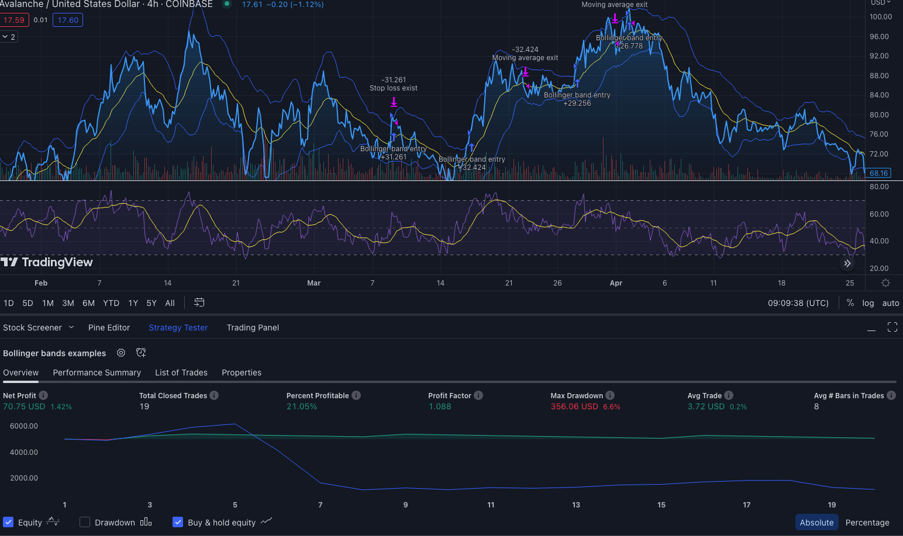
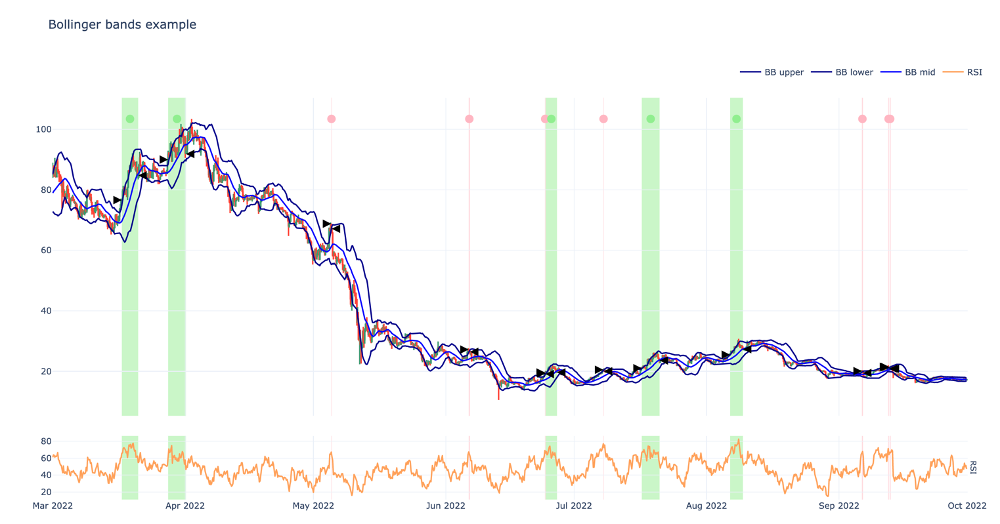
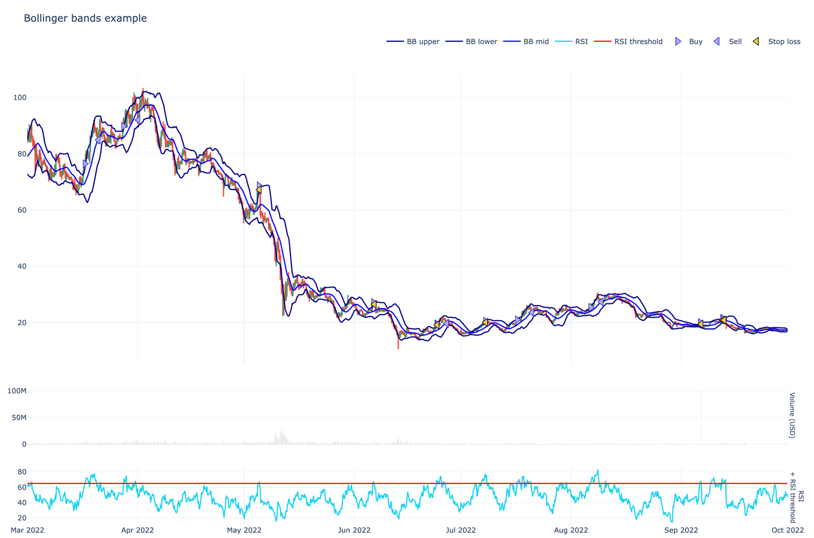

 # TradingView to TradingStrategy.ai algorithmic DeFi trading strategy conversion

This is an example Python project how to convert a TradingView based PineScript algorithmic 
trading strategy to [TradingStrategy.ai](https://tradingstrategy.ai) Python format.

This example repository was made for [Avalanche Summit II workshop](https://tradingstrategy.ai/blog/avalanche-summit-ii-workshop).

   * [Benefits of DeFi for algorithmic traders](#benefits-of-defi-for-algorithmic-traders)
   * [Prerequisites](#prerequisites)
      * [Your skills](#your-skills)
      * [Software](#software)
   * [About the example strategy](#about-the-example-strategy)
      * [Technical indicator documentation](#technical-indicator-documentation)
   * [Strategy performance results and algorithm porting notes](#strategy-performance-results-and-algorithm-porting-notes)
      * [Equity curve](#equity-curve)
      * [Price action and positions](#price-action-and-positions)
      * [Trading summary](#trading-summary)
      * [Position timeline](#position-timeline)
   * [Example code](#example-code)
   * [Notable differences between Python and PineScript](#notable-differences-between-python-and-pinescript)
   * [About trading on decentralised finance](#about-trading-on-decentralised-finance)
      * [DEX trading fees](#dex-trading-fees)
   * [Installation](#installation)
      * [API key](#api-key)
   * [Running backtests](#running-backtests)
      * [Running backtest notebooks from terminal](#running-backtest-notebooks-from-terminal)
      * [Running backtest notebooks with Visual Studio Code](#running-backtest-notebooks-with-visual-studio-code)
      * [Running backtest notebooks Jupyter](#running-backtest-notebooks-jupyter)
   * [Variations of the backtest example](#variations-of-the-backtest-example)
   * [Next steps](#next-steps)


## Benefits of DeFi for algorithmic traders

Running your trading strategy on [decentralised exchanges](https://tradingstrategy.ai/glossary/decentralised-exchange) instead of centralised exchanges have several benefits:

- Execute your strategy in a counterparty risk free manner 
- Broker free, direct to exchange
- Have 100% control of your strategy market data and live execution
- [Low trading fees on efficient decentralised markets](https://tradingstrategy.ai/blog/most-efficient-market-is-on-a-public-blockchain-and-decentralised)
- Convert your trading algorithm to a on-chain fund
  - Benefits of rich Python quant finance libraries like [pandas_ta](https://github.com/twopirllc/pandas-ta) and [quantstats](https://github.com/ranaroussi/quantstats).

## Prerequisites

### Your skills

To work with this example, you need to have

- Basic experience in cryptocurrencies
- Basic experience in trading
- Experience in TradingView's PineScript
- Junior software developer level experience in Python

### Software 

- Python 3.10
- [Poetry package manager for Python](https://tradingstrategy.ai/community)
- Git

## About the example strategy

The example strategy is a simple [Bollinger band](https://tradingstrategy.ai/glossary/bollinger-bands) strategy.
**Whether it makes profit or not is outside the scope of the example.** The strategy is not optimised at all and parameters
are picked more or less by a gut feeling. Please use this example as learning material and base for your own strategies. 

- Use [Bollinger Band's](https://tradingstrategy.ai/glossary/bollinger-bands) and [RSI](https://tradingstrategy.ai/glossary/relative-strength-index-(rsi)) to determine position entries
- Long only - suitable for [DEX spot markets](https://tradingstrategy.ai/glossary/spot-market) like Trader Joe
- 4 hours timeframe for candles
- Backtesting period of 2024-04-01 - 2023-04-01
- Use a tight stop loss when entering a position
  - This will result multiple positions closed for stop loss and few profitable positions during market rallies

- We target the following live trading pairs 
  - [EAVAXTH/USDC pair on Trader Joe on Avalanche with 20 BPS fee tier](https://tradingstrategy.ai/trading-view/polygon/uniswap-v3/eth-usdc-fee-5).
    See a note about this in `decide_trades()` Python code.
  - [Coinbase ETH/USDC with 60 BPS market taker fee](https://help.coinbase.com/en/exchange/trading-and-funding/exchange-fees) (12x more expensive than DeFi)
 
**Note**: Long only strategies are challenging in a descending or sideways cryptocurrencies market like 2021-2023. Furthermore, this strategy was handpicked
for an overly short backtesting period, to better illustrate the features of the backtesting framework.

### Technical indicator documentation

Find documentation for technical indicators used in the example

- [Exponential Moving Average (EMA)](https://tradingstrategy.ai/docs/programming/api/technical-analysis/overlap/help/pandas_ta.overlap.ema.html#ema):
  The Exponential Moving Average is a more responsive moving average compared to the Simple Moving Average (SMA). The weights are determined by alpha which is proportional to it’s length. 

- [Relative Strength Index (RSI)](https://tradingstrategy.ai/docs/programming/api/technical-analysis/momentum/help/pandas_ta.momentum.rsi.html#rsi):
  The Relative Strength Index is a popular momentum oscillator used to measure the velocity as well as the magnitude of directional price movements.

- [Bollinger Bands (BB)](https://tradingstrategy.ai/docs/programming/api/technical-analysis/volatility/help/pandas_ta.volatility.bbands.html#bbands):
  A popular volatility indicator by John Bollinger.

## Strategy performance results and algorithm porting notes

Both TradingView and Trading Strategy strategies open positions in a similar fashion, so they are more or less comparable.

**Note**. Because of the different price feeds and other subtle differences you cannot have the same strategy backtest
    result on two different markets: Coinbase and Trader Joe.**. If you carefully examine the price chart, RSI and other indicators,
    you will see the results vary a bit. In such a small backtesting timeframe, this strategy is prone to small fluxuations
    and is not robust. The goal of this example, however, is not robustness, but easily demonstrable data.

If you examine, some of positions like ~March 17th are opened around the same time, 
so we do see that the strategy is following the same pattern.

Both strategy implementations make a low number of trades, 10-20, for the backtesting period.
This makes it easier to demonstrate the example.

### Equity curve

How well the strategy would have historically performed on AVAX-USDC pair on Trader Joe on Avalanche (20 BPS fee).


How well the strategy would have historically performed on AVAX-USD on Coinbase (no fees).



However, if we switch on 50 BPS taker fee on Coinbase we can see it destroys the strategy performance,
going to loss (vs. 20 BPS fee on Trader Joe).


### Positions taken

Here is a screenshot of individual won/lost positions in Python strategy.
You can see we have few profitable long duration positions, and very short duration
unprofitable positions.




### Price action and indicators

Here is a screenshot of the price action and technical indicators of the strategy.



### Trading summary

Summary statistics are calculated as follow:

```                                                
Trading period length                     145 days
Return %                                    11.90%
Annualised return %                         29.88%
Cash at start                            $5,000.00
Value at end                             $5,594.84
Trade volume                            $47,387.00
Position win percent                        55.56%
Total positions                                  9
Won positions                                    5
Lost positions                                   4
Stop losses triggered                            4
Stop loss % of all                          44.44%
Stop loss % of lost                        100.00%
Winning stop losses                              0
Winning stop losses percent                  0.00%
Losing stop losses                               4
Losing stop losses percent                 100.00%
Take profits triggered                           0
Take profit % of all                         0.00%
Take profit % of won                         0.00%
Zero profit positions                            0
Positions open at the end                        0
Realised profit and loss                   $594.84
Portfolio unrealised value                   $0.00
Extra returns on lending pool interest       $0.00
Cash left at the end                     $5,594.84
Average winning position profit %            6.72%
Average losing position loss %              -2.57%
Biggest winning position %                  12.12%
Biggest losing position %                   -2.76%
Average duration of winning positions       3 days
Average duration of losing positions        0 days
LP fees paid                                $94.87
LP fees paid % of volume                     0.20%
Average position:                            2.59%
Median position:                             1.65%
Most consecutive wins                            2
Most consecutive losses                          3
Biggest realized risk                       -1.38%
Avg realised risk                           -1.28%
Max pullback of total capital               -4.00%
Max loss risk at opening of position         1.10%
```

### Position timeline

Here are individual positions.


## Example code

The example strategy is presented as  

- [PineScript source file](./bollinger_band_example_tradingview_strategy.pine) 
- [Backtesting Jupyter Notebook for Trading Strategy](./bollinger_band_example_defi_strategy.ipynb)

Strategy core:

```python
rsi_series = rsi(close_prices, length=RSI_LENGTH)

# Calculate Bollinger Bands with a 20-day SMA and 2 standard deviations using pandas_ta
# See documentation here https://tradingstrategy.ai/docs/programming/api/technical-analysis/volatility/help/pandas_ta.volatility.bbands.html#bbands
bollinger_bands = bbands(close_prices, length=MOVING_AVERAGE_LENGTH, std=STDDEV)

# bbands() returns a dictionary of items with different name mangling
bb_upper = bollinger_bands[f"BBU_{MOVING_AVERAGE_LENGTH}_{STDDEV}"]
bb_lower = bollinger_bands[f"BBL_{MOVING_AVERAGE_LENGTH}_{STDDEV}"]
bb_mid = bollinger_bands[f"BBM_{MOVING_AVERAGE_LENGTH}_{STDDEV}"]  # Moving average

if not position_manager.is_any_open():
    # No open positions, decide if BUY in this cycle.
    # We buy if the price on the daily chart closes above the upper Bollinger Band.
    if price_latest > bb_upper.iloc[-1] and rsi_series[-1] >= RSI_THRESHOLD:
        buy_amount = cash * POSITION_SIZE
        trades += position_manager.open_1x_long(
            pair, 
            buy_amount, 
            stop_loss_pct=STOP_LOSS_PCT)

else:
    # We have an open position, decide if SELL in this cycle.
    # We close the position when the price closes below the 20-day moving average.        
    if price_latest < bb_mid.iloc[-1]:
        trades += position_manager.close_all()
```            

## Notable differences between Python and PineScript

Some major differences between Python and PineScript:

- Python is a general-purpose programming language, making a vast number of tutorials, books and courses available for it.
- Python is open source - making a vast number of software libraries like technical indicators and statistics available for it.
- TradingView's PineScript is optimised to be used with their service only. It is streamlined, easier to work with,
  but inflexible.
- PineScript is fast: backtests complete fast as it is simplified what PineScript can do. 
- Python data is presented as Pandas DataFrame's - the de facto core unit of any data science,
  whereas TradingView uses its own data format.
- Trading Strategy's `decide_trades()` function is designed to suit all kind of strategies, including portfolio construction, lending strategies,
  liquidity provider positions and such. Thus, it will return a list of trades to be executed on a blockchain to enter a new position
  and you have more finer-grained control than PineScript's entry/exit that has been designed for traditional stock markets.

Some differences traders should note:

- Trading Strategy use a term [position](https://tradingstrategy.ai/glossary/position) to cover a trading position with entry and exit,
  where as TradingView is using a term *trade*. This might be confusing because a single position consists of multiple trades.
- Because the price feed is not 1:1 same (different exchanges),
  different trades will be taken at a different time
- Depending on a blockchain and DEX, the assets use wrapped token notation.
  E.g. `ETH` becomes `WETH`. This is due to the technical limitations of [EVM-compatible blockchains](https://tradingstrategy.ai/glossary/evm-compatible).

Some differences programmer's should note:

- Python use the zero indexed arrays unlike PineScript that uses reverse arrays. In Python, like in most programming languages,
  the latest value of time series is in the last index of an array, noted by `-1` and the oldest value is in zero index `0`.
  In PineScript, this is the opposite, where the latest value is noted without index or index 0.

## About trading on decentralised finance

### DEX trading fees

You have four elements of fees

- Blockchain transaction costs or [gas fees](https://tradingstrategy.ai/glossary/gas-fee)
  - Going towards zero and neglible in the future
- Trading fee, which consists of
  - [Liquidity provider fee](https://tradingstrategy.ai/glossary/liquidity-provider) 
  - ...and [protocol fee](https://tradingstrategy.ai/glossary/protocol-fee) 
  - Usually 0.05% for large Uniswap v3 pools, otherwise 0.25% - 0.30% on [AMMs](https://tradingstrategy.ai/glossary/amm)
  - [Compares to 0.60% taker fee on Coinbase, others]()
- [Price impact](https://tradingstrategy.ai/glossary/price-impact)
  - Unlike on order book exchanges, this is very easy to historically backtest on AMMs due to deterministic nature of the price
    based on liquidity
- [Slippage](https://tradingstrategy.ai/glossary/slippage)
  - Price change between signing your transction and having a block producer to include it in a block 
  - Also important for [MEV protection](https://tradingstrategy.ai/glossary/mev)
  - Usually orders are signed with maximum slippage
- AMM and [CLMM](https://tradingstrategy.ai/glossary/clmm) based DEXes do not have slippage

## Installation

Make a git clone of this repository and then run `poetry` to create a Python environment for your project.

```shell
poetry shell
poetry install
```

### API key

When you run the notebook for the first time, you will be prompted to register to give an API key to download Trading Strategy datasets.

## Running backtests

### Running backtest notebooks from terminal

Running the backtesting notebook in a terminal is the most robust, though not that useful method 

- Works always - you see if your code works
- Opens any charts separate windows in a web browser
- But it's very hard to work with notebooks in a terminal
- Using shell for notebooks allows e.g. you to use `ipdb` breakpoints in Python code.

How to run:

```shell
ipython bollinger_band_example_defi_strategy.ipynb 
```

This will open a couple of browser tabs and print out the trading summary as

### Running backtest notebooks with Visual Studio Code

Visual Studio Code is the recommended tool for the backtest development.

First start Poetry environment in a terminal:

```shell
poetry shell
```

**Within this shell session**, start Visual Studio Code.

```shell
code 
```

Open a notebook in Visual Studio Code.

Use `Select Kernel` at the top right of the screen. Visual Studio Code should recommend you the same Python virtual environment
that is installed with Poetry.

Run the notebook.

### Running backtest notebooks Jupyter

You can start Jupyter by:

```shell
poetry shell
jupyter notebook
```
Then choose a notebook from the file explorer and run it

## Variations of the backtest example

We have created some alternatives on the notebook to show how it affects profit and loss

Baseline: Annual return 14%, max drawdown 7%.

- [Trailing stop loss](/delayed_trailing_stop_loss.ipynb) - Annual return 18%, max drawdown 7%
- [All in](./all_in.ipynb): Use 90% of cash instead of 50% of cash when entering a position. Realised profit $300 -> $600.
- [Multipair](./multipair.ipynb): Trade more than single pair
- [Uniswap full history](/uniswap_v2_full_history.ipynb): Trade on ETH-USD pair based on Uniswap v2, so we get max DEX 2020-2023 backtesting history
- [Uniswap 1h candles](./uniswap_v2_1h_candle_stddev_1.ipynb): Same as above, but trade very frequently

## Next steps

- [Join the Trading Strategy community Discord for discussion and questions](https://tradingstrategy.ai/docs/)
- [View our learning material for algorithmic trading](https://tradingstrategy.ai/docs/learn/index.html)
- [Study other strategy backtesting examples and code samples](https://tradingstrategy.ai/docs/programming/index.html)