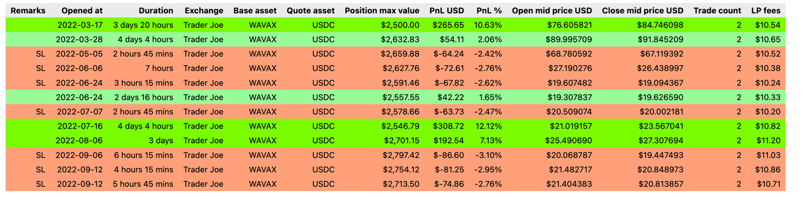

 # TradingView to TradingStrategy.ai algorithmic DeFi trading strategy conversion

This is an example Python project how to convert a TradingView based PineScript algorithmic 
trading strategy to [TradingStrategy.ai](https://tradingstrategy.ai) Python format.

This example repository was made for [Avalanche Summit II workshop](https://tradingstrategy.ai/blog/avalanche-summit-ii-workshop).

   * [Benefits of DeFi trading](#benefits-of-defi-trading)
   * [Preqrequisites](#preqrequisites)
      * [Your skills](#your-skills)
      * [Software](#software)
   * [About the example strategy](#about-the-example-strategy)
      * [Technical indicator documentation](#technical-indicator-documentation)
   * [Strategy performance results and algorithm porting notes](#strategy-performance-results-and-algorithm-porting-notes)
      * [Equity curve](#equity-curve)
      * [Price action and positions](#price-action-and-positions)
      * [Trading summary](#trading-summary)
      * [Position timeline](#position-timeline)
   * [Example code](#example-code)
   * [Notable differences between Python and PineScript](#notable-differences-between-python-and-pinescript)
   * [About trading on decentralised finance](#about-trading-on-decentralised-finance)
      * [DEX trading fees](#dex-trading-fees)
   * [Installation](#installation)
      * [API key](#api-key)
   * [Running backtests](#running-backtests)
      * [Running backtest notebooks from terminal](#running-backtest-notebooks-from-terminal)
      * [Running backtest notebooks with Visual Studio Code](#running-backtest-notebooks-with-visual-studio-code)
   * [Next steps](#next-steps)


## Benefits of DeFi trading

Running your trading strategy on [decentralised exchanges](https://tradingstrategy.ai/glossary/decentralised-exchange) instead of centralised exchanges have several benefits:

- Execute your strategy in a counterparty risk free manner 
- Broker free, direct to exchange
- Have 100% control of your strategy market data and live execution
- [Low trading fees on efficient decentralised markets](https://tradingstrategy.ai/blog/most-efficient-market-is-on-a-public-blockchain-and-decentralised)
- Convert your trading algorithm to a on-chain fund
  - Benefits of rich Python quant finance libraries like `pandas_ta` and `quantmetrics`=

## Preqrequisites

### Your skills

To work with this example, you need to have

- Basic experience in cryptocurrencies
- Basic experience in trading
- Experience in TradingView's PineScript
- Junior software developer level experience in Python

### Software 

- Python 3.10
- [Poetry package manager for Python](https://tradingstrategy.ai/community)
- Git

## About the example strategy

The example strategy is a simplified [Bollinger band](https://github.com/tradingstrategy-ai/tradingview-defi-strategy) strategy.
**Whether it makes profit or not is outside the scope of the example.** The strategy is not optimised at all and parameters
are picked more or less by a gut feeling. Please use this example as learning material and base for your own strategies. 

- Use Bollinger Band's and [RSI](equity-curve-coinbase-with-fees.png) to determine position entries
- Long only - suitable for [DEX spot markets](https://tradingstrategy.ai/glossary/spot-market)
- Daily timeframe for candles
- Backtesting period of 2022-01-01 - 2023-04-01
- Use a tight stop loss when entering a position
  - This will result to multiple positions closed for stop loss and few profitable positions during market rallies

- We target the following live trading pairs 
  - [ETH/USDC pair on Uniswap v3 on Polygon with 5 BPS fee tier](https://tradingstrategy.ai/trading-view/polygon/uniswap-v3/eth-usdc-fee-5).
    See a note about this in `decide_trades()` Python code.
  - [Coinbase ETH/USDC with 60 BPS market taker fee](https://help.coinbase.com/en/exchange/trading-and-funding/exchange-fees) (12x more expensive than DeFi)
 
**Note**: Long only strategies are challenging in a descending or sideways cryptocurrencies market like 2021-2023.

### Technical indicator documentation

Find documentation for technical indicators used in the example

- [Exponential moving average (EMA)](https://tradingstrategy.ai/docs/programming/api/technical-analysis/overlap/help/pandas_ta.overlap.ema.html#ema):
  The Exponential Moving Average is a more responsive moving average compared to the Simple Moving Average (SMA). The weights are determined by alpha which is proportional to it’s length. 

- [Relative strength indicator (RSI)](https://tradingstrategy.ai/docs/programming/api/technical-analysis/momentum/help/pandas_ta.momentum.rsi.html#rsi):
  The Relative Strength Index is a popular momentum oscillator used to measure the velocity as well as the magnitude of directional price movements.

- [Bollinger bands](https://tradingstrategy.ai/docs/programming/api/technical-analysis/volatility/help/pandas_ta.volatility.bbands.html#bbands):
  A popular volatility indicator by John Bollinger.

## Strategy performance results and algorithm porting notes

Both TradingView and Trading Strategy strategies open positions in a similar fashion, so they are more or less comparable.

**Because of the different price feeds and other subtle differences you cannot have the same strategy backtest
    result on two different markets**.

At least some of positions like ~Jul 20th are opened around the same time, 
so we do see that the strategy is following the same pattern.

**Note**: Minor differences between TradingView and Python technical indicator calculations 
might result to different code execution. However, the example code should be matching enough to demostrate how
to port over TradingView scripts.

Both strategy implementations make a low number of trades, 10-20, for the backtesting period.
This makes it easier to demostrate the the example.

### Equity curve

How well the strategy would have historically performed on ETH-USDC pair on Uniswap v3 on Polygon (5 BPS fee).


How well the strategy would have historically performed on ETH-USDC on Coinbase (no fees).


However, if we switch on 50 BPS taker fee on Coinbase we can see it destroys the strategy performance,
going to loss. 


### Price action and positions

Here is a screenshot of individual won/lost positions in Python strategy.


### Trading summary

Summary statistics are calculated as follow:

```                                                
Trading period length                     357 days
Return %                                    15.80%
Annualised return %                         16.15%
Cash at start                            $5,000.00
Value at end                             $5,789.98
Trade volume                            $32,605.76
Position win percent                        33.33%
Total positions                                  6
Won positions                                    2
Lost positions                                   4
Stop losses triggered                            4
Stop loss % of all                          66.67%
Stop loss % of lost                        100.00%
Winning stop losses                              0
Winning stop losses percent                  0.00%
Losing stop losses                               4
Losing stop losses percent                 100.00%
Take profits triggered                           0
Take profit % of all                         0.00%
Take profit % of won                         0.00%
Zero profit positions                            0
Positions open at the end                        0
Realised profit and loss                   $789.98
Portfolio unrealised value                   $0.00
Extra returns on lending pool interest       $0.00
Cash left at the end                     $5,789.98
Average winning position profit %           20.72%
Average losing position loss %              -2.50%
Biggest winning position %                  22.55%
Biggest losing position %                   -2.95%
Average duration of winning positions      35 days
Average duration of losing positions        5 days
LP fees paid                                $16.31
LP fees paid % of volume                     0.05%
Average position:                            5.24%
Median position:                            -2.16%
Most consecutive wins                            1
Most consecutive losses                          2
Biggest realized risk                       -1.47%
Avg realised risk                           -1.25%
Max pullback of total capital               -2.91%
```

### Position timeline

Here are individual positions.



## Example code

The example strategy is presented as  

- [PineScript source file](./bollinger_band_example_tradingview_strategy.pine) 
- [Backtesting Jupyter Notebook for Trading Strategy](./bollinger_band_example_defi_strategy.ipynb)

## Notable differences between Python and PineScript

Some major differences between Python and PineScript:

- Python is a general-purpose programming language, making a vast number of tutorials, books and courses available for it.
- Python is open source - making a vast number of software libraries like technical indicators and statistics available for it.
- TradingView's PineScript is optimised to be used with their service only. It is streamlined, easier to work with,
  but inflexible.
- PineScript is fast: backtests complete fast as it is simplified what PineScript can do. 
- Python data is presented as Pandas DataFrame's - the de facto core unit of any data science,
  whereas TradingView uses its own data format.
- Trading Strategy's `decide_trades()` function is designed to suit all kind of strategies, including portfolio construction, lending strategies,
  liquidity provider positions and such. Thus, it will return a list of trades to be executed on a blockchain to enter a new position
  and you have more finer-grained control than PineScript's entry/exit that has been designed for traditional stock markets.

Some differences traders should note:

- Trading Strategy use a term [position](https://tradingstrategy.ai/glossary/position) to cover a trading position with entry and exit,
  where as TradingView is using a term *trade*. This might be confusing because a single position consists of multiple trades.
- Because the price feed is not 1:1 same (different exchanges),
  different trades will be taken at a different time
- Depending on a blockchain and DEX, the assets use wrapped token notation.
  E.g. `ETH` becomes `WETH`. This is due to the technical limitations of [EVM-compatible blockchains](https://tradingstrategy.ai/glossary/evm-compatible).

Some differences programmer's should note:

- Python use the zero indexed arrays unlike PineScript that uses reverse arrays. In Python, like in most programming languages,
  the latest value of time series is in the last index of an array, noted by `-1` and the oldest value is in zero index `0`.
  In PineScript, this is the opposite, where the latest value is noted without index or index 0.

## About trading on decentralised finance

### DEX trading fees

You have four elements of fees

- Blockchain transaction costs or [gas fees](https://tradingstrategy.ai/glossary/gas-fee)
  - Going towards zero and neglible in the future
- Trading fee, which consists of
  - [Liquidity provider fee](https://tradingstrategy.ai/glossary/liquidity-provider) 
  - ...and [protocol fee](https://tradingstrategy.ai/glossary/protocol-fee) 
  - Usually 0.05% for large Uniswap v3 pools, otherwise 0.25% - 0.30% on [AMMs](https://tradingstrategy.ai/glossary/amm)
  - [Compares to 0.60% taker fee on Coinbase, others]()
- [Price impact](https://tradingstrategy.ai/glossary/price-impact)
  - Unlike on order book exchanges, this is very easy to historically backtest on AMMs due to deterministic nature of the price
    based on liquidity
- [Slippage](https://tradingstrategy.ai/glossary/slippage)
  - Price change between signing your transction and having a block producer to include it in a block 
  - Also important for [MEV protection](https://tradingstrategy.ai/glossary/mev)
  - Usually orders are signed with maximum slippage
- AMM and [CLMM](https://tradingstrategy.ai/glossary/clmm) based DEXes do not have slippage

## Installation

Make a git clone of this repository and then run `poetry` to create a Python environment for your project.

```shell
poetry shell
poetry install
```

### API key

When you run the notebook for the first time, you will be prompted to register to give an API key to download Trading Strategy datasets.

## Running backtests

### Running backtest notebooks from terminal

Running the backtesting notebook in a terminal is the most robust, though not that useful method 

- Works always - you see if your code works
- Opens any charts separate windows in a web browser
- But it's very hard to work with notebooks in a terminal
- Using shell for notebooks allows e.g. you to use `ipdb` breakpoints in Python code.

How to run:

```shell
ipython bollinger_band_example_defi_strategy.ipynb 
```

This will open couple of browser tabs and print out the results

```
Trading period length                       0 days
Return %                                     0.00%
Annualised return %                              -
Cash at start                           $10,000.00
Value at end                            $10,000.00
Trade volume                                 $0.00
Position win percent                             -
Total positions                                  0
Won positions                                    0
Lost positions                                   0
Stop losses triggered                            0
Stop loss % of all                               -
Stop loss % of lost                              -
Take profits triggered                           0
Take profit % of all                             -
Take profit % of won                             -
Zero profit positions                            0
Positions open at the end                        0
Realised profit and loss                     $0.00
Portfolio unrealised value                   $0.00
Extra returns on lending pool interest       $0.00
Cash left at the end                    $10,000.00
Average winning position profit %                -
Average losing position loss %                   -
Biggest winning position %                       -
Biggest losing position %                        -
Average duration of winning positions       0 days
Average duration of losing positions        0 days
LP fees paid                                 $0.00
LP fees paid % of volume                     0.00%
Average position:                            0.00%
Median position:                             0.00%
Most consecutive wins                            0
Most consecutive losses                          0
Biggest realized risk                        0.00%
Avg realised risk                            0.00%
Max pullback of total capital                0.00%
Max loss risk at opening of position         0.00%
```

### Running backtest notebooks with Visual Studio Code

First start a server from command line

```shell
poetry shell
jupyter server 
```

Copy the kernel URL with the secret token from the console output.] 

Open any notebook in Visual Studio Code.

Use `Select Kernel` at the top right of the screen, choose Remot Jupyter Kernel, add URL option.
Paste in the URL  (should b e automatically pasted).

Run the notebook.

## Next steps

- [Join Trading Strategy community Discord for discussion and questions](https://tradingstrategy.ai/docs/)
- [View our learning material for algorithmic trading](https://tradingstrategy.ai/docs/learn/index.html)
- [Study other strategy backtesting examples and code samples](https://tradingstrategy.ai/docs/programming/index.html)